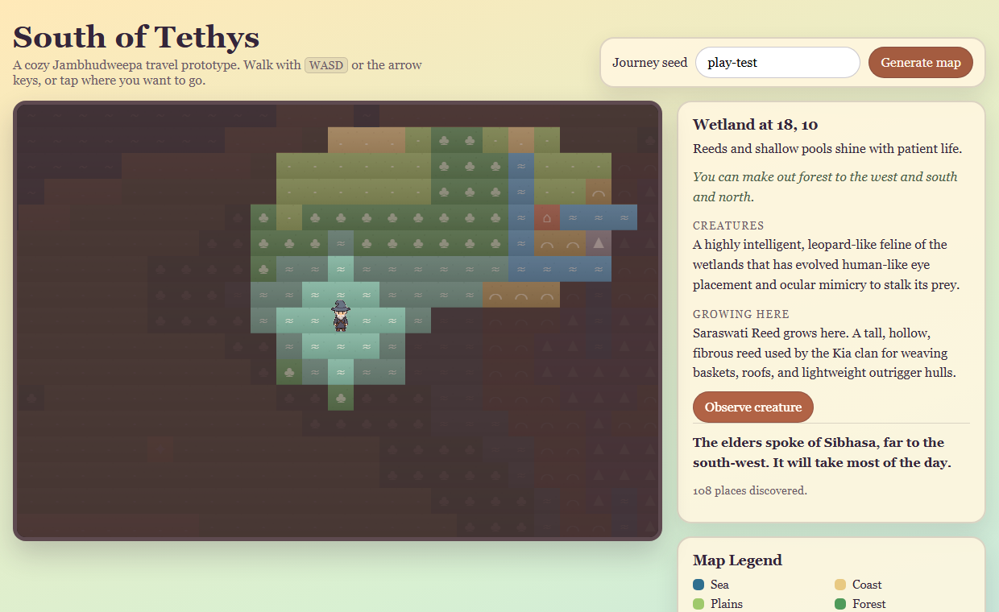

# South of Tethys: Jambhudweepa Adventure

*Part of **The Ark of South Tethys: A Solarpunk Odyssey** — stories from the edge of time.*

A cozy 2D exploration game set in an invented ancient South Asia. You walk a seeded map of river
deltas, monsoon forest, ochre hill country and a highland spine, keeping a travel journal of the
terrain, creatures and plants you pass, until you find the landmark the elders told you about.

**There is no combat and no threat.** Creatures are observed, not fought. The feeling to aim for is
a quiet afternoon walk with a sketchbook.



## Play

```bash
npm install
npm run dev        # http://localhost:4173
```

Walk with **WASD** or the **arrow keys**, or **tap a tile** — tapping routes around the sea rather
than into it. Press **Observe creature** to sketch what you find, and head for the named landmark;
arriving writes a page you can keep as text or an image.

A seed travels in the URL, so a journey is a link: try
[`?seed=play-test`](http://localhost:4173/?seed=play-test), `?seed=river-road`, or
`?seed=monsoon-evening`. `?hour=21` overrides the time of day, which otherwise follows your own
clock.

> **Not yet hosted.** The build is verified against a subpath deploy, but GitHub Pages has never
> been enabled for this repository, so the workflow is parked. See
> [Deployment](#deployment) below.

## What's in it

- **A generator that produces real geography.** Terrain is built from octaves of value noise over a
  seeded highland spine, so every seed has hills, mountains and rivers running off them to the
  water. `test/generator.test.ts` asserts this on twenty seeds.
- **236 creatures and 70 plants**, placed by biome, each with authored journal prose.
- **Invented place names.** Settlements, rivers and landmarks are named from seeded syllables —
  Thenavati, Hudhukoli, the Shanesarin — so a map reads as a country rather than a grid.
- **Seven kinds of landmark**, each suited to the ground it stands on, each with a written page for
  arriving.
- **A day that passes**, opening on the hour you actually sat down to play.
- **A journal you can take with you**, as a markdown file or a rendered page of writing.

## Commands

```bash
npm run dev          # serve at http://localhost:4173
npm test             # vitest — world, content, journal, day/night
npm run test:e2e     # playwright — does the game boot, draw and play?
npm run typecheck    # tsc --noEmit
npm run build        # static bundle into dist/
npm run build:data   # regenerate data/creatures.json and data/flora.json
npm run build:sprite # rebuild the character sheets from assets/source/
```

The browser suite needs `npx playwright install chromium` once.

## World content

The flora and fauna canon lives in [docs/bestiary.md](docs/bestiary.md): 300 species across seven
regions, from the Saraswati deltas to the Asura-tainted horrors.

`data/creatures.json` and `data/flora.json` are **generated** from that document — run
`npm run build:data` rather than editing them. CI fails if the committed copies have drifted.
`data/biomes.json` and `data/landmarks.json` are hand-written.

Character art is generated too: `assets/*-overworld.png` are built from the full-size sheets in
`assets/source/` by `npm run build:sprite`. See [docs/art-brief.md](docs/art-brief.md) for how the
art is commissioned and what the build does to it.

## Deployment

`npm run build` emits plain static files, so the game can be hosted on GitHub Pages, Hostinger, or
anything that serves a folder. `DEPLOY_BASE` sets the subpath.

The Pages workflow is currently **parked at manual-trigger only**, because Pages has never been
enabled for this repository and `configure-pages` 404s until it is — and a workflow that always
fails just teaches people to ignore red. To turn it on:

1. Settings → Pages → Build and deployment → Source: **GitHub Actions**
2. Run *Deploy to Pages* once from the Actions tab
3. Restore the push trigger at the top of `.github/workflows/pages.yml`

The build itself is known good: the browser suite passes against a subpath build served the way
Pages serves it.

## Documentation

- [CLAUDE.md](CLAUDE.md) — architecture, commands and known issues, for anyone (or any agent)
  picking up the code
- [Phaser plan](docs/phaser-plan.md) — the current plan and the four weeks to a hosted demo
- [Game plan](docs/game-plan.md) — vision, MVP, gameplay loop, milestones
- [World generator design](docs/world-generator.md) — generation inputs, passes, success criteria
- [Bestiary and herbarium](docs/bestiary.md) — the authored canon, by region
- [Art brief](docs/art-brief.md) — how the character art is specified, and what went wrong twice
- [Source layout](src/README.md) — the four layers and the rules between them
- [Playtest guide](src/PLAYTEST.md) — showcase seeds and what to look for
- [Playtest notes](docs/playtest-notes.md) — what walking the map actually turned up
- [Build plan](docs/build-plan.md) — the earlier audit; Phase 0 is superseded by the Phaser plan

## Licence

MIT — see [LICENSE](LICENSE).
