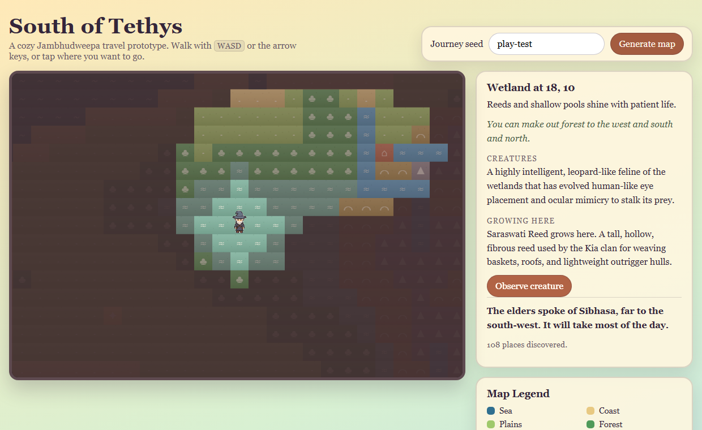

# South of Tethys: Jambhudweepa Adventure

*Part of **The Ark of South Tethys: A Solarpunk Odyssey** — stories from the edge of time.*

A cozy 2D exploration game set in an invented ancient South Asia. You are Varuna, a naturalist,
travelling four field maps of river delta, cold desert harbour, basalt plateau and the Aravali
crossing. You look closely at what lives and lies there, help the people you meet, and on three of
the maps settle among them, building a place they back and move into.

**There is no combat and no threat.** Creatures are observed, not fought. The feeling to aim for is
a quiet afternoon walk with a sketchbook.



## Play

```bash
npm install
npm run dev        # http://localhost:4173
```

Walk with **WASD** or the **arrow keys**, or **tap a tile** — tapping routes around the sea rather
than into it. Whatever is out as you pass records itself in your **collection**; there is nothing
to press. Head for the named landmark, and arriving writes a page you can keep as text or an
image from the **Diary**.

Zoom with the on-screen **+** and **−**, the mouse wheel, `+`/`-`, or a pinch. `0` hands the view
back to the automatic fit, which sizes itself to your screen.

A seed travels in the URL, so a journey is a link: try
[`?seed=play-test`](http://localhost:4173/?seed=play-test), `?seed=river-road`, or
`?seed=monsoon-evening`. `?hour=21` overrides the time of day, which otherwise follows your own
clock.

> **Play it now:** <https://lordlebu.github.io/4000BCESaraswathy/> — deployed from `main` by
> `.github/workflows/pages.yml`. See [Deployment](#deployment) below.

## What's in it

- **A generator that produces real geography.** Terrain is built from octaves of value noise over a
  seeded highland spine, so every seed has hills, mountains and rivers running off them to the
  water. `test/generator.test.ts` asserts this on twenty seeds.
- **232 creatures and 112 plants**, placed by biome, each with authored journal prose.
- **Invented place names.** Settlements, rivers and landmarks are named from seeded syllables —
  Thenavati, Hudhukoli, the Shanesarin — so a map reads as a country rather than a grid.
- **Seven kinds of landmark**, each suited to the ground it stands on, each with a written page for
  arriving.
- **A night you have to answer.** The light goes, the journal says so, and you sleep under a roof,
  at a camp, or on the bedroll you carry. Being caught out costs the night and nothing else: no
  discoveries, no observations, and you wake exactly where you stopped.
- **A day that passes**, opening on the hour you actually sat down to play — and that walking
  spends. Thirty kilometres between one dawn and the next and a little over a third of a kilometre
  to the tile, so a day of easy going is about eighty steps and a long march through the hills goes
  amber and then blue under you.
- **Ground that gives what is standing on it.** The rice you cut is the rice you were reading
  about: canon says which species a material comes from, and a tile offers what actually grows
  there rather than anything the biome could hold.
- **Places that run down and come back.** A worked reed bed is visibly worked before you stoop,
  and it regrows on canon's own schedule — days, a season, years, or never. Stone never regrows;
  working the ground *reveals* more of it, which is why a district that gave up six hundred
  stone still has some.
- **Eighteen kinds of ground**, including snow above the treeline, cooled lava, and the turf of a
  sky island. Each carries its own scatter and its own tall things.
- **A journal you can take with you**, as a markdown file or a rendered page of writing.
- **People who are where they are.** A place says who is in it now, strangers on the road can be
  talked to and remember you, and what they say about camps and places turns into events.
- **Settling, talked rather than fought.** On Lothal, Dwarka and the Narmada you win a ground's
  holder round by listening, showing what you have learned and having the people you helped vouch
  for you. Then you build in three stages and the people move in. See
  [docs/settling-in.md](docs/settling-in.md).

## Commands

```bash
npm run dev          # serve at http://localhost:4173
npm test             # vitest — world, content, journal, day/night
npm run test:e2e     # playwright — does the game boot, draw and play?
npm run typecheck    # tsc --noEmit
npm run build        # static bundle into dist/
npm run check:data   # verify data/canon/ matches the canon release it came from
npm run build:sprite # rebuild the character sheets from assets/source/
```

The browser suite needs `npx playwright install chromium` once.

## World content

The flora and fauna canon lives in the **SouthOfTethys** repository, not here — 232 fauna and 112
flora among 765 entities, alongside the field maps, discoveries, questions, people, happenings, homesteads and vocabulary
the game is made of. [docs/bestiary.md](docs/bestiary.md) is the prose document those species were
originally extracted from, kept for provenance; it is no longer upstream of anything. 344 species across seven
regions, from the Saraswati deltas to the Asura-tainted horrors.

`data/canon/` is **generated** by `utils/export_canon_bundle.py` in the canon repository and must
never be hand-edited; `npm run check:data` fails if it drifts. **No command in this repository
rebuilds it** — for a while this paragraph ended by naming one that had never existed as a script
here, which is worse than saying nothing because it costs the reader the time to find out. To
change any of it, edit the entity in `SouthOfTethys` and re-export from there.
`data/biomes.json` and `data/landmarks.json` are hand-written.

Character art is generated too: `assets/*-overworld.png` are built from the full-size sheets in
`assets/source/` by `npm run build:sprite`. See [docs/art-brief.md](docs/art-brief.md) for how the
art is commissioned and what the build does to it.

## Deployment

`npm run build` emits plain static files, so the game can be hosted on GitHub Pages, Hostinger, or
anything that serves a folder. `DEPLOY_BASE` sets the subpath.

`.github/workflows/pages.yml` deploys on every push to `main`. It is the **only** workflow that
should touch Pages: turning Pages on makes GitHub offer to commit a `jekyll-gh-pages.yml` as well,
which would publish this README rendered as a web page rather than the game, and fight the real
workflow over the shared `pages` concurrency group. Decline it.

The build is verified against a subpath deploy — the browser suite passes against `dist/` served at
`/4000BCESaraswathy/`, which is how Pages serves it. To check that yourself before a deploy:

```powershell
$env:DEPLOY_BASE = '/4000BCESaraswathy/'
npx vite build
npx vite preview --port 4180                 # same env var, same shell
$env:PLAYWRIGHT_BASE_URL = 'http://localhost:4180/4000BCESaraswathy/'
npm run test:e2e
```

### itch.io, jams and other portals

**The game is live at <https://lordlebu.itch.io/south-of-tethys>** (v0.1.0, 30 September 2026).
[docs/publishing.md](docs/publishing.md) records who it is published for, how the listing was set,
and what stopped the first release.

Questions, bugs and thoughts reach the author at <https://x.com/landofmyst>. The rest of the world
the game is set in -- peoples, events, eras -- is readable in the lore portal at
<https://south-of-tethys-canon.vercel.app/>, which the canon repository publishes.

`.github/workflows/release.yml` builds a portable copy of the game and publishes it to itch.io. It
runs when a `v*` tag is pushed, or by hand from the Actions tab, and not on every merge: a jam
entry should not change while it is being judged.

One-time setup:

1. Create the project on itch.io with *Kind of project* set to **HTML**.
2. In this repository's *Settings → Secrets and variables → Actions*, add the variable
   `ITCH_TARGET` (`<itch-user>/<project-slug>`) and the secret `BUTLER_API_KEY` (from
   <https://itch.io/user/settings/api-keys>).
3. Run the workflow, then on the itch.io project's edit page tick **This file will be played in
   the browser** on the `html5` upload. Set the embed to 960 × 600 or larger, with the fullscreen
   button and mobile-friendly options on.

Until step 2 is done the workflow still builds and simply skips publishing. Every run also keeps
`south-of-tethys-<version>.zip` as an artifact, with `index.html` at its root — that is the file to
upload by hand to Newgrounds or to a jam that is not hosted on itch.io.

To make the same build locally:

```powershell
$env:DEPLOY_BASE = './'
npx vite build          # dist/ now plays from any folder on any static host
```

## Documentation

- [CLAUDE.md](CLAUDE.md) — architecture, commands and known issues, for anyone (or any agent)
  picking up the code
- [Retrospective](docs/retrospective.md) — the whole project from its first commit to the Settling
  In plan: what worked, what did not, and what to do next
- [Settling In](docs/settling-in.md) — the endgame plan, concluded: camps, cart points and homesteads
- [Phaser plan](docs/phaser-plan.md) — the current plan and the four weeks to a hosted demo
- [Game plan](docs/game-plan.md) — vision, MVP, gameplay loop, milestones
- [World generator design](docs/world-generator.md) — generation inputs, passes, success criteria
- [Bestiary and herbarium](docs/bestiary.md) — where the species came from, kept for provenance
- [The ground that gives](docs/the-ground-that-gives.md) — gathering, resource nodes, and the two design rulings behind them
- [Handover: the crossing and the basalt](docs/handover-crossing-and-basalt.md) — both plans closed, the stamp rule they leave behind, and what is still open
- [Publishing](docs/publishing.md) — where the game is live, the audience it is listed for, and how to release
- [Testing notes](docs/testing.md) — what the failures here have cost, and the rules that came out of them
- [Art brief](docs/art-brief.md) — how the character art is specified, and what went wrong twice
- [Source layout](src/README.md) — the four layers and the rules between them
- [Playtest guide](src/PLAYTEST.md) — showcase seeds and what to look for
- [Playtest notes](docs/playtest-notes.md) — what walking the map actually turned up
- [Build plan](docs/build-plan.md) — the earlier audit; Phase 0 is superseded by the Phaser plan

## Licence

MIT — see [LICENSE](LICENSE).
